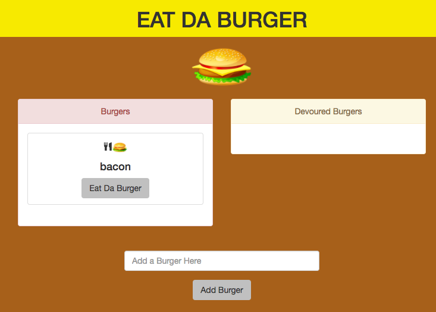

Link to the deployed Heroku application: https://fathomless-anchorage-60746.herokuapp.com/index

## Description
***
Eat the Burger is a simple demonstration of a full stack application. This app enables the user to add a burger to the burger menu, then press the eat-da-burger button to send it to the devoured list. This application uses MySQL and Sequelize to keep the data persistant. When the burger is added to the menu, it also adds it to the database, which is hosted through the Heroku add-on JawsDB. The app then renders and uses handlebars to check a 'devoured' variable and puts it in the correct list accordingly. 

#### Contributors:
***

Casey Rubel [GitHub](https://github.com/caseyrubel)

#### Technologies Used:
***

* Javascript
* nodeJS
* MySQL
* handlebars
* Bootstrap

